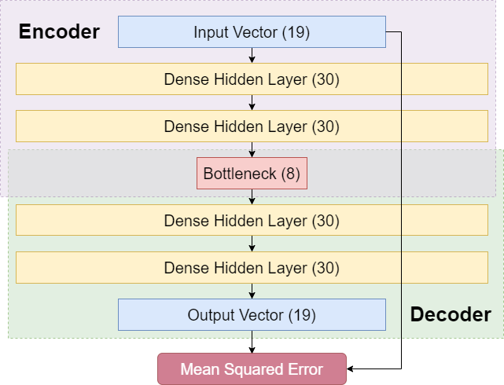
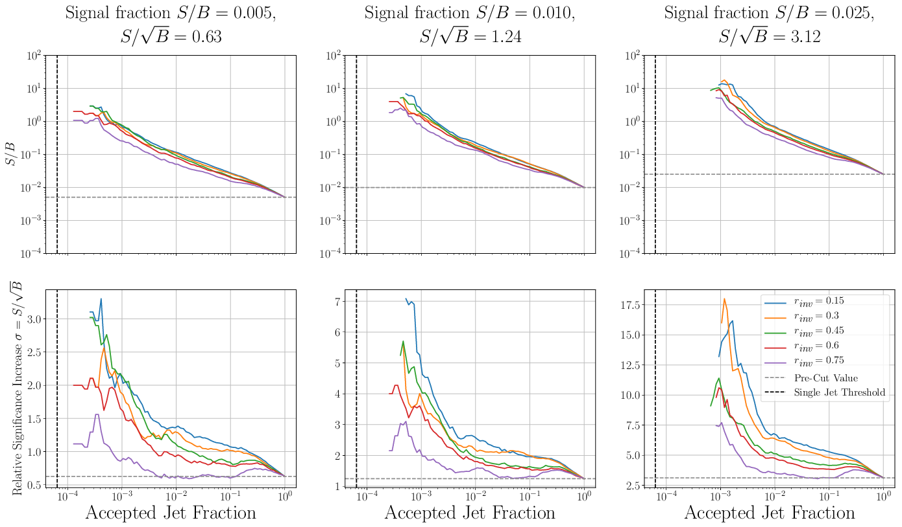
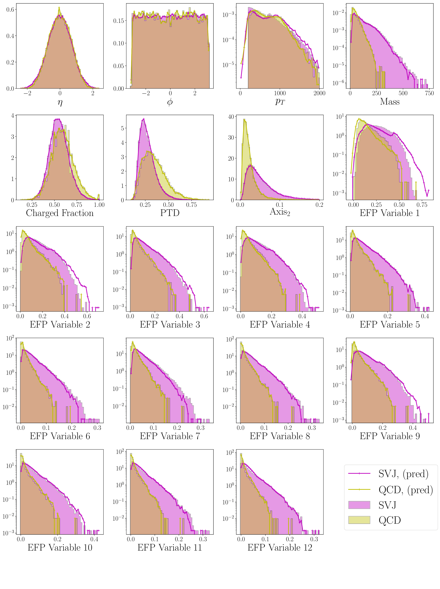
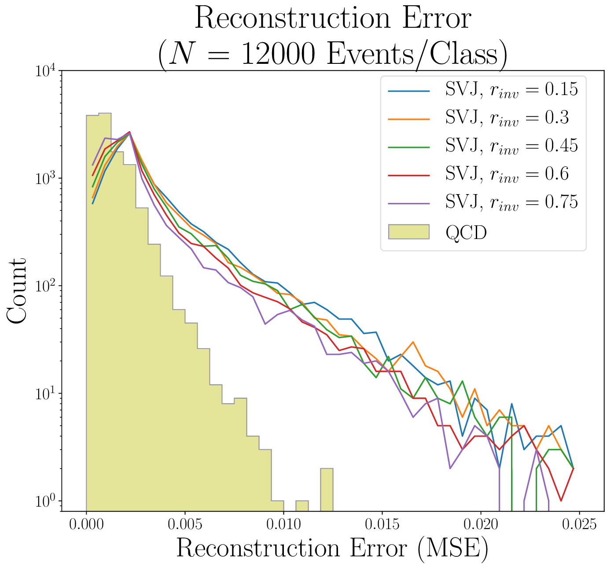
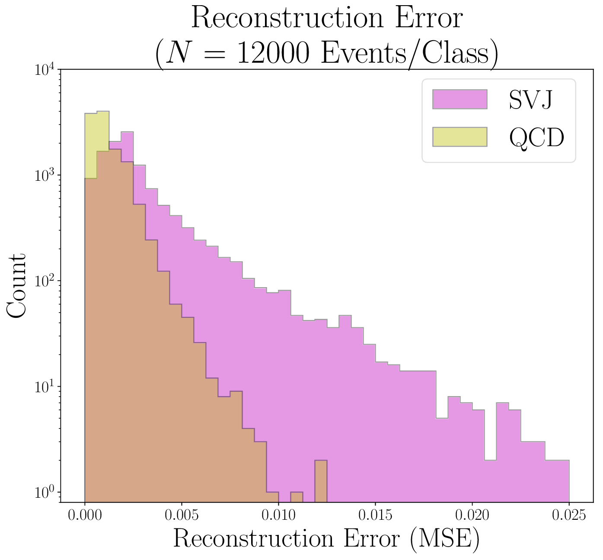

# Autoencoders for Semi-Visible Jet Detection

autoencoders + semivisible jet analysis implementation. All code, plots, and writing done by Luc Le Pottier (@luclepot on github)

## Contents
- [Overview](#analysis-overview)
- [Usage](#usage)

# analysis overview

[Semi-visible jets](https://arxiv.org/abs/1503.00009) are a promising explanation for both the **missing transverse momenta** in proton-proton collisions at the LHC and for the **nature and origin of Dark Matter**. This theory, however, admits new "dark sector" particles with a wide range of unconstrained parameters. In the case we investigate for this analysis, we consider a hypothetical dark sector W-boson . For this particle, the chief unconstrained parameters are

1. the fraction of dark sector particles decaying back to the Standard Model  and
2. the mass of the  boson

Rather than deploy an ensemble of searches across a grid of possible combinations - as might be done in a traditional analysis - we make use of a neural autoencoder to estimate the QCD background in a supervised manner. We then evaluate this autoencoder over a wide range of signal parameters, and show that **the autoencoder has excellent signal discovery across a range of signal parameters.**

Autoencoder architecture is shown here:

Relative significance increases and S/B ratios across a cut on the autoencoder MSE betweeen inputs and reconstructions are shown below as well. By observation, significance increases are ~6 in the maximum range, indicating good discovery.

Also relevant are the input and reconstructions distributions of the data. These include a set of Energy Flow Polynomials, which form a basis for describing jet substructure. These are shown in the figure below.

Lastly, we consider the MSE distributions data and signal, showing good discrimination over all combined signals. Specifically, the signals have a large tail on the reconstruction distribution, indicated that many were poorly reconstructed. The slightly higher MSE peak in the distribution than the QCD peak also indicates that signal is generally more poorly reconstructed. 

# usage

## selection/conversion

this analysis is implemented in sections, the first two of which are controlled by the `driver.py` file in the main repository.  
to see general driver behavior, run `python driver.py -h` using any old python installation.

your options are 
 
 - `select`: select events from a delphes root file, use -h for more info
 - `convert`: convert selections into h5 files (trainable data)

## training

A full implementation of the python analysis, on selected/converted data, can be found in the [`full_method.ipynb`](/full_method.ipynb) file.

training is implemented entirely in the `autoencode` directory. Here there is a helper module, `autoencodeSVJ`, whose components can be used in python code analyses. A few current examples of such analyses (jupyter notebooks!) are given in the root directory. 

The environment used for training is python `2.7.*`, with keras/tensorflow. On `lxplus` or any tier 3 server you might use the provided `setup.sh`. 

